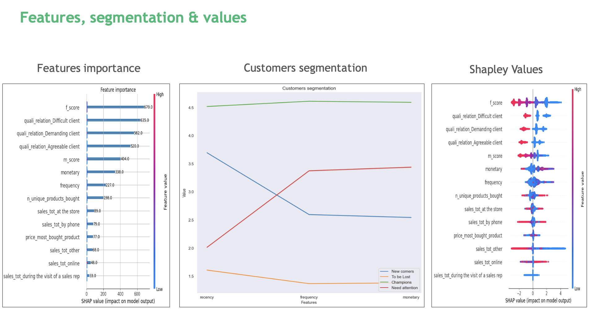

# Portfolio

## **Silos Detector**
Computer Vision Hackathon by **Mckinsey Quantum Black**. Developed an AI solution for silos detection and tracking using CNN-based image classification and segmentation (Demo done using Streamlit).

-   [**GitHub Repo**](https://github.com/yousssefjouini/silos-detector/)

- **Description:** Built a tech solution comprising:
    - Image Classification: CNN with Adam optimizer and Binary Cross Entropy loss -> AUC of 0.93
    - Image Segmentation: U-Net CNN -> Dice coefficient of 0.75

## **Customer Churn Prediction**

Hackathon by **BCG Gamma**. Customer Churn Prediction from transactional data. It uses XGBoost classifier and Synthetic Minority Oversampling Technique (SMOTE) technique to predict whether a customer is likely to churn or not.

-   [**GitHub Repo**](https://github.com/yousssefjouini/customer-churn-prediction/)

- **Description:**
    Keys results:
    - 76% of churning customers identified (Recall)
    - 55% of predicted churning found to have churned (Precision)
    - 88% of non-churning customers identified

    Focus on Model Explainability:

## **The Right Pricer**

Hackathon by Eleven Strategy  in 2023, with the objective of developing a reliable model for estimating real estate prices based on historical transactional data of property buys and sells in France.

-   [**GitHub Repo**](https://github.com/yousssefjouini/real-estate-pricer/)

- **Description:**
    Keys results:
    - Estimation property prices based on relevant property features.
    - Enhanced interpretability by employing feature importance analysis, LIME (Local Interpretable Model-agnostic Explanations), and Shapley values

    

## **News Sentiment Analyzer**

## **Sustainability**

